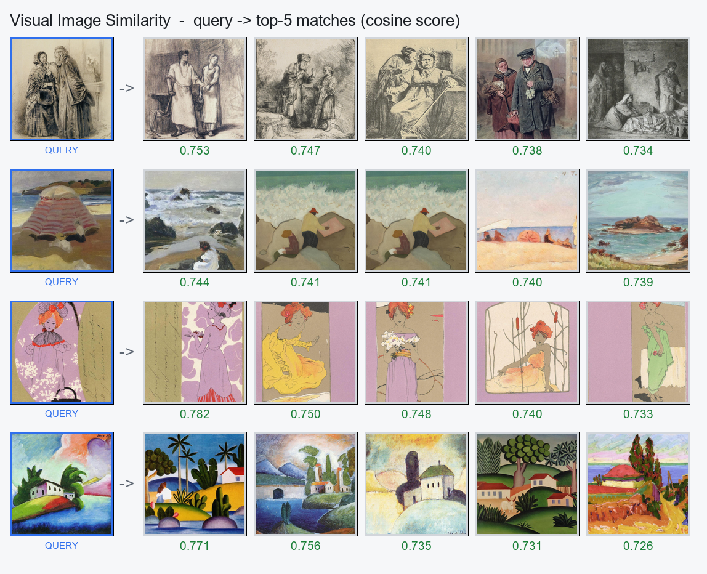
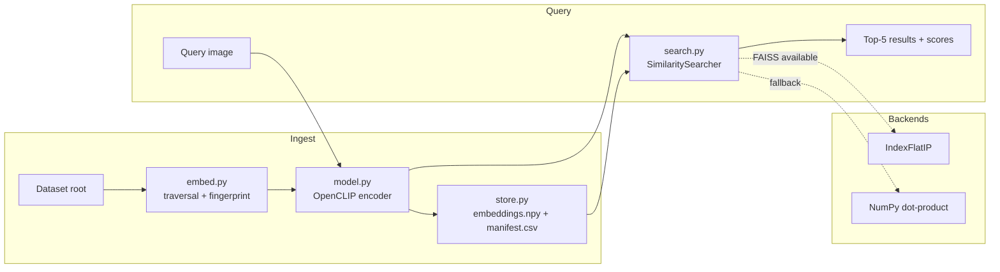

# Visual Image Similarity Search — WikiArt

A production-quality engine that, given a query painting, returns the most
visually similar paintings from an ~81,000-image WikiArt corpus together with
their similarity scores. Built around a pretrained **OpenCLIP** vision encoder,
a backend-agnostic search layer (**FAISS** with an automatic NumPy fallback),
and an incremental embedding pipeline that never recomputes work it has already
done.

```
Query image ──▶ OpenCLIP encoder ──▶ 512-d unit vector ──▶ FAISS / NumPy ──▶ Top-5 matches + scores
```



*Each row: a query painting (blue outline) and its top-5 nearest neighbours with
cosine scores. Generated from the final index — see [Demo](#demo).*

> **Evaluate in ~5 minutes (no dataset required):** browse this README and the
> results image above, open [`demo/demo.html`](demo/demo.html) in a browser, and
> run the dataset-free tests with `pip install -r requirements-dev.txt && pytest`.
> To try the engine live without the full ~1.75 h corpus build, cap it:
> `python -m src.embed --limit 2000` then
> `python -m src.search --query "<image>" --top-k 5`.

---

## Table of contents

- [Overview](#overview)
- [Dataset](#dataset)
- [Architecture](#architecture)
- [Design decisions](#design-decisions)
- [Installation](#installation)
- [Dataset setup](#dataset-setup)
- [Embedding generation](#embedding-generation)
- [Similarity search](#similarity-search)
- [Demo](#demo)
- [Docker usage](#docker-usage)
- [Performance considerations](#performance-considerations)
- [Benchmark](#benchmark)
- [Limitations](#limitations)
- [Future improvements](#future-improvements)

---

## Overview

The system has three responsibilities, each isolated in its own module:

1. **Encode** every image into a fixed-length embedding that captures visual and
   semantic content (`src/model.py`, `src/embed.py`).
2. **Persist** those embeddings efficiently and **update them incrementally** as
   images are added or removed (`src/store.py`).
3. **Search** the embedding space for nearest neighbours behind a stable public
   API, regardless of which backend is installed (`src/search.py`).

Similarity is **cosine similarity**. Embeddings are L2-normalised at generation
time, so an inner product *is* the cosine — the search layer never re-normalises
and both backends return identical scores in `[-1, 1]`.

## Dataset

The dataset is the *Processed WikiArt* corpus. Its structure was established by
direct inspection rather than assumption:

| Property | Finding |
| --- | --- |
| Images on disk | **81,444**, all `.jpg` |
| Layout | **27 flat style folders** (e.g. `Cubism/`, `Impressionism/`); no nesting |
| Filename convention | `artist-name_title-year.jpg` |
| Non-image content | `notebooks/`, `reports/` (6 `.png` figures), `classes.csv`, `wclasses.csv` |
| Metadata | `classes.csv` covers 80,042 images (artist, style, `phash`, dimensions, split) |

Two consequences shaped the design:

- **The filesystem is authoritative.** Images are discovered by walking the
  dataset root; `notebooks/` and `reports/` are excluded so the 6 report PNGs are
  never indexed. `classes.csv` covers only ~98% of images, so it is joined as
  optional *enrichment* (artist names), never as a source of truth.
- **No assumptions leak into code.** Paths, extensions and excluded directories
  are all configurable; the defaults simply match what inspection revealed.

## Architecture



| Module | Responsibility |
| --- | --- |
| `src/config.py` | Immutable configuration; resolves *CLI > env var > default*. |
| `src/model.py` | Model loading, preprocessing, L2-normalised embedding generation. |
| `src/store.py` | Atomic, incremental persistence of the three-file index. |
| `src/embed.py` | Dataset traversal, batched encoding, metadata join, checkpointing. |
| `src/search.py` | `SimilaritySearcher` abstraction, FAISS/NumPy backends, query engine. |
| `scripts/benchmark.py` | Measures throughput, latency, index size and peak RAM. |
| `demo/` | Static HTML gallery and interactive Streamlit app. |

The persisted index is three transparent files under `embeddings/`:

- `embeddings.npy` — `float32` `[N, 512]` matrix of unit-norm vectors.
- `manifest.csv` — one row per image: relative path, style, artist, title, and
  the `size`/`mtime` fingerprint used for incremental updates.
- `index_meta.json` — model identity, dimensionality, counts and timing.

Row *i* of the matrix corresponds to row *i* of the manifest.

## Design decisions

**Why OpenCLIP ViT-B-32 (`laion2b_s34b_b79k`).** CLIP embeddings encode both
low-level appearance (colour, composition, texture) and high-level semantics
(subject, style), which is exactly what "visually similar art" needs. ViT-B-32
is the lightest strong CLIP variant: 512-dimensional output, the best
quality/latency trade-off for CPU-only inference at this scale, and a small
index footprint (81k × 512 × 4 B ≈ 167 MB). DINOv2 and ResNet-50 are supported
by swapping the model name, but CLIP's joint image–text training gives more
robust cross-style retrieval out of the box.

**Why normalise once, at write time.** Normalising embeddings to unit length
turns cosine similarity into a plain inner product. FAISS's `IndexFlatIP` and the
NumPy backend then both reduce to a single matrix multiply, queries need no
per-call normalisation, and scores are directly comparable across backends.

**Why an exact flat index, not IVF/HNSW.** At ~81k × 512 the entire index is
~167 MB and an exact brute-force search answers a query in single-digit
milliseconds (see [Benchmark](#benchmark)). Exact search returns true nearest
neighbours with zero training, tuning or recall loss. Approximate indexes only
pay off at 10–100× this scale; adding them here would be complexity without
benefit.

**Why a backend abstraction.** `SimilaritySearcher` defines one API
(`search(queries, k) -> (scores, indices)`). `build_searcher()` picks FAISS when
it is importable and transparently falls back to a vectorised NumPy
implementation otherwise. Callers — and the public results — are identical either
way, so FAISS is a performance dependency, not a hard one.

**Why incremental by fingerprint.** Re-embedding 81k images is expensive, so it
must never happen twice. Each run fingerprints every image by `(size, mtime)`.
Only new or changed images are encoded; unchanged vectors are copied forward and
deleted images drop out of the index. Adding a handful of new paintings costs
seconds, not hours.

**Why checkpointing.** A full CPU build takes over an hour, so the pipeline
persists a resumable checkpoint every *N* images. An interrupted run resumes from
the last checkpoint on the next invocation — the same incremental machinery makes
already-embedded images "reused".

**Why draft-mode JPEG decoding.** Every image is downscaled to 224 px, so the
loader calls Pillow's `Image.draft()` to let libjpeg decode large source JPEGs at
reduced (DCT-scaled) resolution. Measured decode throughput roughly doubles
(≈53 → ≈129 img/s) with no measurable effect on embeddings.

**Why decode in worker processes.** Image decoding is CPU-bound and embarrassingly
parallel; model inference is a single batched call. A PyTorch `DataLoader` runs
decoding across worker processes while the model encodes one batch at a time, so
peak RAM is bounded by `batch_size`, not by the dataset size. Only the picklable
preprocessing transform is sent to workers — the model weights are never
duplicated.

**Why route SSL through the OS trust store.** On machines behind a corporate
proxy the proxy's root CA is trusted by the OS but absent from `certifi`, which
breaks model downloads. Importing `truststore` (when available) fixes this
transparently and is a harmless no-op elsewhere.

## Installation

Requires **Python 3.11+**.

```bash
git clone <repository-url> ml-image-similarity
cd ml-image-similarity

python -m venv .venv
# Windows:  .venv\Scripts\activate
# Linux/Mac: source .venv/bin/activate

pip install -r requirements.txt
```

The first embedding run downloads the OpenCLIP weights (~600 MB) once and caches
them under the Hugging Face cache directory. FAISS is optional — omit `faiss-cpu`
and the engine automatically uses the NumPy backend.

Run the (dataset-free) test suite with:

```bash
pip install -r requirements-dev.txt
pytest
```

The two commands above are also the fastest way to confirm the project works on
a given machine: `pytest` exercises the storage, search (FAISS and NumPy) and
error-handling stack without the dataset or model, and a capped run
(`python -m src.embed --limit 2000`) then verifies the PyTorch/OpenCLIP path.

### Tested with

The pipeline was verified end-to-end on **Python 3.12.2** (works on 3.11+) with
the versions below. `requirements.txt` intentionally uses minimum-version floors
so pip can resolve current, platform-appropriate wheels; if a newer release ever
misbehaves, install the exact verified set with `pip install -r requirements.lock`.

| Package | Version | | Package | Version |
| --- | --- | --- | --- | --- |
| torch | 2.11.0 | | numpy | 2.3.4 |
| torchvision | 0.26.0 | | pandas | 2.3.0 |
| open_clip_torch | 3.3.0 | | Pillow | 10.0.0 |
| faiss-cpu | 1.14.3 | | streamlit | 1.38.0 |
| tqdm | 4.67.1 | | psutil | 7.0.0 |
| truststore | 0.10.4 | | | |

## Dataset setup

Point the pipeline at the dataset with an environment variable (nothing is
copied into the repository):

```bash
# Windows (PowerShell)
$env:WIKIART_DATASET_ROOT = "C:\path\to\wikiart"

# Linux/Mac
export WIKIART_DATASET_ROOT=/path/to/wikiart
```

`DATASET_ROOT` is accepted as an alias, and every command also takes an explicit
`--dataset-root` flag.

## Embedding generation

```bash
python -m src.embed
```

Useful options:

```bash
python -m src.embed \
  --dataset-root "/path/to/wikiart" \
  --embeddings-dir embeddings \
  --batch-size 64 \
  --num-workers 4 \
  --checkpoint-every 10000 \
  --limit 500          # smoke-test on the first 500 images
```

Re-running is safe and cheap: unchanged images are skipped, new images are
appended, and deleted images are removed. Device selection is automatic
(`--device auto` uses CUDA when present, else CPU).

## Similarity search

Command line:

```bash
python -m src.search --query "/path/to/query.jpg" --top-k 5
```

```
Query: /path/to/query.jpg
------------------------------------------------------------------------
1. score=0.8123  [Impressionism]  claude monet - water lilies 1916
     Impressionism/claude-monet_water-lilies-1916.jpg
...
```

Add `--json` for machine-readable output or `--no-faiss` to force the NumPy
backend. Programmatic use:

```python
from src.config import Config
from src.search import SimilarityEngine

engine = SimilarityEngine(Config.from_env())
for hit in engine.search("query.jpg", k=5):
    print(hit.rank, round(hit.score, 4), hit.path)
```

The fastest way to judge retrieval quality is the **preview image above**
([`demo/preview.png`](demo/preview.png)) — it renders inline on GitHub, so no
download or setup is needed.

For an interactive look there are two committed, self-contained artifacts, both
generated from the final index and requiring **no dependencies, no server, no
model download, and no dataset access**:

- **[`demo/preview.png`](demo/preview.png)** — a flat contact sheet. Renders
  inline anywhere (including this README).
- **[`demo/demo.html`](demo/demo.html)** — a richer gallery with artist/style
  captions. Note that GitHub shows `.html` as source, so **download it and open
  it in a browser** (or use the raw file) to view the rendered page.

**Regenerate either from the current index** (query images are a seeded random
sample, so output is reproducible):

```bash
python demo/generate_demo.py --num-queries 6 --seed 42 --output demo/demo.html
python demo/generate_demo.py --num-queries 4 --seed 11 --png demo/preview.png
python demo/generate_demo.py --query "/path/to/query.jpg"   # a specific query
```

**Interactive Streamlit app** (runs locally; needs the dataset and a built index):

```bash
streamlit run demo/app.py
```

Upload an image or draw a random one from the corpus and inspect the top matches
live; the index and model are cached across interactions.

**Interactive Streamlit app:**

```bash
streamlit run demo/app.py
```

Upload an image or draw a random one from the corpus and inspect the top matches
live; the index and model are cached across interactions.

## Docker usage

```bash
docker build -t wikiart-similarity .

# Generate embeddings (dataset read-only, embeddings persisted to the host)
docker run --rm \
  -v /data/wikiart:/data/wikiart:ro \
  -v "$(pwd)/embeddings:/app/embeddings" \
  -e WIKIART_DATASET_ROOT=/data/wikiart \
  wikiart-similarity python -m src.embed

# Serve the interactive demo at http://localhost:8501
docker run --rm -p 8501:8501 \
  -v /data/wikiart:/data/wikiart:ro \
  -v "$(pwd)/embeddings:/app/embeddings" \
  -e WIKIART_DATASET_ROOT=/data/wikiart \
  wikiart-similarity
```

The image installs CPU-only PyTorch wheels, runs as a non-root user, and mounts
both the dataset and the embeddings as volumes so it stays small and stateless.

## Performance considerations

- **Memory-bounded ingestion.** RAM during embedding is governed by `batch_size`
  and worker count, not dataset size — the full corpus never sits in memory.
- **CPU thread usage.** Inference uses all CPU threads; a small number of decode
  workers keeps the model fed without oversubscribing cores. On a GPU box the
  same code path runs an order of magnitude faster with no changes.
- **Compact storage.** A single contiguous `.npy` matrix loads with one
  (optionally `mmap`-ed) read, keeping the search path allocation-free.
- **Exact, fast queries.** A flat inner-product index answers queries in a few
  milliseconds at this scale; latency is dominated by encoding the query image,
  not by the search itself.
- **Atomic writes.** Every index file is written to a temporary path and renamed,
  so an interrupted save can never corrupt an existing index.
- **Graceful query handling.** A missing or corrupt/unsupported query image yields
  a clear, typed error (`InvalidQueryImageError`) and a clean CLI/UI message —
  never a stack trace — while the underlying cause is still logged at error level.

### Where the time goes (profiled)

The embedding pipeline was profiled stage-by-stage on the reference CPU (400
images, single thread except inference):

| Stage | Throughput |
| --- | --- |
| JPEG decode (draft mode) | ~57 img/s |
| Decode + preprocess | ~72 img/s |
| **Model inference (batch 64)** | **~12.7 img/s** |
| Full pipeline (4 decode workers) | ~12.7 img/s |

**The bottleneck is model inference**, not disk I/O, decoding, preprocessing or
storage — decode + preprocess is ~5.6× faster than inference, so parallel decode
workers fully hide it and the end-to-end rate equals the inference rate. This is
the expected, correct behaviour for a transformer on CPU: further CPU-side tuning
(more workers, faster decoding) cannot help a pipeline already bound by the model.
The only levers that would move the number are a smaller/quantised model (a
quality trade-off) or a GPU, where the same code runs roughly 10–50× faster.

## Benchmark

Measured on the full corpus on the reference machine below (no GPU):

| Metric | Value |
| --- | --- |
| Hardware | Intel64 Family 6 Model 140 (8 logical cores), **CPU-only** |
| Model | OpenCLIP ViT-B-32 (`laion2b_s34b_b79k`) |
| Search backend | `faiss.IndexFlatIP` |
| Images indexed | **81,444** |
| Embedding dimensionality | **512** |
| Total embedding time | **6,402 s (106.7 min)** |
| Images / second (embedding) | **12.7** |
| Avg query latency (encode + search) | **197.4 ms** |
| p95 query latency | **227.3 ms** |
| Avg search-only latency | **7.5 ms** |
| Embedding index size (`embeddings.npy`) | **159.1 MB** |
| Manifest size (`manifest.csv`) | **10.6 MB** |
| Peak process RAM (query serving) | **1.9 GB** |

Reading the numbers:

- **End-to-end query latency is dominated by encoding the query image (~190 ms
  on CPU), not by search.** The exact FAISS lookup over all 81,444 vectors takes
  only **7.5 ms**; on a GPU the encode step drops by an order of magnitude.
- **Embedding throughput** is CPU-bound at ~12.7 img/s across 8 cores (decoding
  runs in worker processes so it never bottlenecks inference). The same code on a
  single modern GPU embeds the corpus in a few minutes.
- **Peak RAM** shown is for the query-serving process (index held in memory plus
  the model). The embedding process is bounded by `batch_size` × workers rather
  than dataset size; use `mmap` loading (`EmbeddingStore.load(mmap=True)`) to
  serve the index with a near-constant memory footprint.


Reproduce with:

```bash
python scripts/benchmark.py --queries 50
```

All figures are measured from the persisted index and live query runs, not
estimated.

### Qualitative evaluation

Retrieval quality was assessed on **30 randomly sampled queries** (fixed seed,
query image excluded from its own results), combining automatic statistics with
direct visual inspection of every result:

| Measure | Value |
| --- | --- |
| Mean top-1 cosine | **0.82** |
| Mean top-5 cosine | **0.80** |
| Minimum top-1 cosine | **0.73** |
| Mean same-style paintings in top-5 (of 5) | **2.4** |

Observations:

- **Results are consistently coherent in subject and palette.** Portraits
  retrieve portraits, landscapes retrieve landscapes, botanical studies retrieve
  botanical studies, and figure/nude studies retrieve figure studies — with a
  matching dominant colour palette and composition.
- **In-corpus near-duplicates rank first as expected** (e.g. a Monet *Water
  Lilies* query returns other *Water Lilies* at ~0.91–0.93), with the exact query
  image correctly excluded.
- **Style-label agreement (2.4/5) understates quality.** Six of the 30 queries had
  no same-style neighbour in the top-5, but on inspection these are visually
  sound cross-style matches (e.g. a Post-Impressionist portrait retrieving a
  Fauvist portrait). WikiArt's style folders are adjacent and overlapping, so they
  are a weak proxy for visual similarity — CLIP retrieves on visual content, which
  legitimately crosses style boundaries.
- **Weakest case:** a near-monochrome brown Realism canvas (top-1 0.73) retrieved
  muted, low-detail sketches — palette-consistent but thematically loose. No hard
  failures (results unrelated in subject, palette *and* composition) were observed.

This is a proxy evaluation, not a labelled-ground-truth benchmark; see
[Future improvements](#future-improvements) for a recall/mAP harness.

## Limitations

Honest constraints of the current implementation:

- **Benchmarks were measured on CPU** (no GPU on the reference machine). A
  full-corpus build takes ~107 min and query encoding ~190 ms; the identical code
  path runs roughly 10–50× faster on a single GPU.
- **The exact flat index holds the full 159 MB matrix in RAM** (FAISS keeps its
  own copy). This is the right choice at 81k vectors, but a substantially larger
  corpus would need approximate indexing (IVF/HNSW/PQ) or the already-supported
  memory-mapped serving path (`EmbeddingStore.load(mmap=True)`).
- **Retrieval quality is validated by a proxy** — cosine scores, style-label
  agreement and manual visual inspection over 30 queries — not a labelled
  recall/mAP benchmark, because the dataset ships no relevance ground truth.
- **The first run requires network access** to download the ~600 MB model weights
  (cached thereafter). Behind a corporate proxy, `truststore` routes certificate
  verification through the OS trust store so the download succeeds.

## Future improvements

- **Approximate search (IVF/HNSW)** behind the existing abstraction once the
  corpus grows past a few hundred thousand images.
- **Product quantization** to shrink the index for memory-constrained serving.
- **Text-to-image queries** — CLIP is multimodal, so the same index already
  supports natural-language search ("a stormy seascape") with a text encoder.
- **A thin FastAPI service** exposing `/search` for horizontal scaling behind a
  load balancer.
- **Metadata-filtered search** (by style, artist or period) using the manifest
  columns already persisted alongside the vectors.
- **A small labelled retrieval set** to track recall/mAP as models or preprocessing change.
